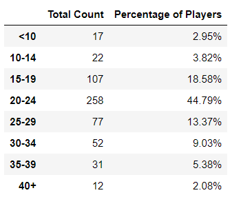
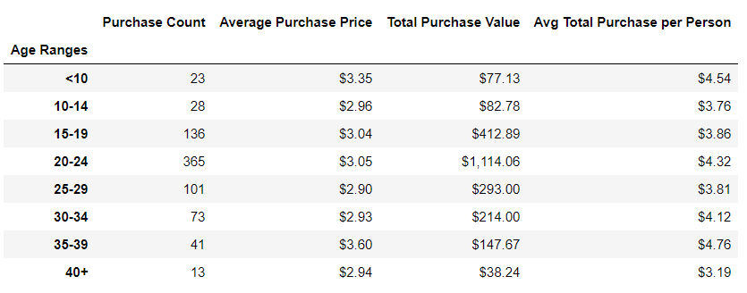

# Trends

* The mayor percentage of players are Male with the 84.03%

* The age of the users that most play games is between 20 to 24 years which are also the group with the highest total purchase value with $1,114.06.

* The most profitable and popular item is **Final Citric** with *13* purchases with a total purchase value of *$59.99*.

