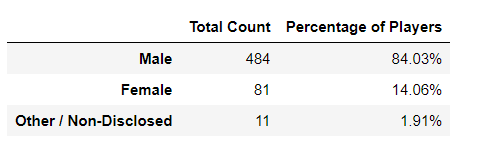
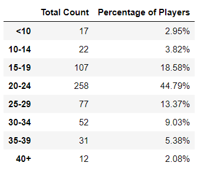
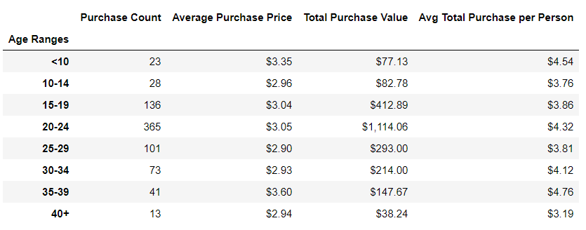
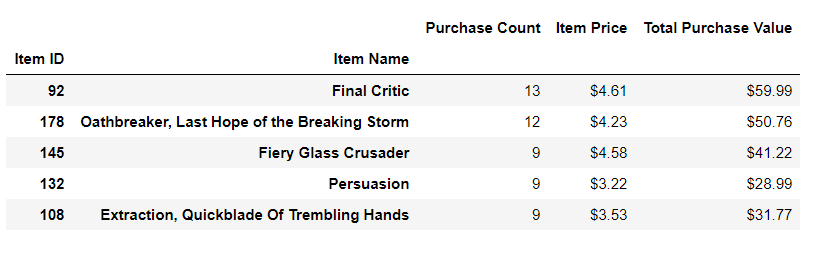

# Pandas Challenge

The Pandas Challenge choosen was **Heroes of Pymoli**

## Repository Table of Contents
|Name|Description|
|---|---|
|**Images**|Folder with images|
|**Resources/purchase_data.csv**|The data source to be analized|
|**HeroesOfPymoli.ipynb**| Jupiter Notebook used to sketch, test, and for POC|
|**HeroesOfPymoli_starter.ipynb**| Jupyter Notebook with the challenge solution|
|**Obsevable Trends.md**| The written observable trends detected after the analysis |

# Observable Trends

* The mayor percentage of players are Male with the 84.03%

* The age of the users that most play games is between 20 to 24 years which are also the group with the highest total purchase value with $1,114.06.

* The most profitable and popular item is **Final Citric** with *13* purchases with a total purchase value of *$59.99*.

# Background
## Option 1: Heroes of Pymoli

Congratulations! After a lot of hard work in the data munging mines, you've landed a job as Lead Analyst for an independent gaming company. You've been assigned the task of analyzing the data for their most recent fantasy game Heroes of Pymoli.

Like many others in its genre, the game is free-to-play, but players are encouraged to purchase optional items that enhance their playing experience. As a first task, the company would like you to generate a report that breaks down the game's purchasing data into meaningful insights.

The final report includes each of the following:

### Player Count

* Total Number of Players

### Purchasing Analysis (Total)

* Number of Unique Items
* Average Purchase Price
* Total Number of Purchases
* Total Revenue

### Gender Demographics

* Percentage and Count of Male Players
* Percentage and Count of Female Players
* Percentage and Count of Other / Non-Disclosed

### Purchasing Analysis (Gender)

* The below each broken by gender
  * Purchase Count
  * Average Purchase Price
  * Total Purchase Value
  * Average Purchase Total per Person by Gender

### Age Demographics

* The below each broken into bins of 4 years (i.e. &lt;10, 10-14, 15-19, etc.)
  * Purchase Count
  * Average Purchase Price
  * Total Purchase Value
  * Average Purchase Total per Person by Age Group

### Top Spenders

* Identify the the top 5 spenders in the game by total purchase value, then list (in a table):
  * SN
  * Purchase Count
  * Average Purchase Price
  * Total Purchase Value

### Most Popular Items

* Identify the 5 most popular items by purchase count, then list (in a table):
  * Item ID
  * Item Name
  * Purchase Count
  * Item Price
  * Total Purchase Value

### Most Profitable Items

* Identify the 5 most profitable items by total purchase value, then list (in a table):
  * Item ID
  * Item Name
  * Purchase Count
  * Item Price
  * Total Purchase Value

* You must include a written description of three observable trends based on the data.
## TODO include the 3 observable trends
